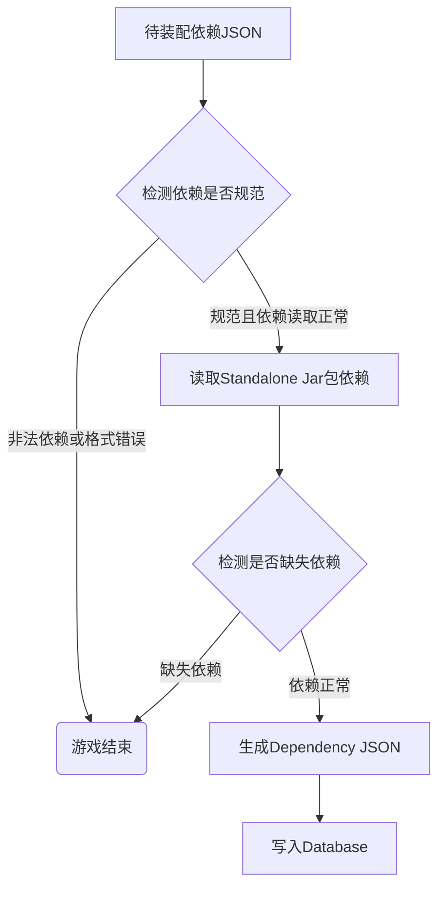

# 服务单元依赖装配

>**主要为实现为Standalone JAR包依赖情况的维护，便于新增服务单元注入依赖，确保Standalone依赖的清晰化和可见化。**

## 1. 流程



- 本地用户根据DenpendencyUtil.jar包工具生成目标Jar包的**Dependency JSON**；
- 用户根据**Denpendency JSON**调用下述`/api/jar/dependencies/{id}/negotiation`接口获取依赖匹配情况；
- 用户根据上述接口返回信息处理完成后，调用下述`/api/jar/dependencies/{id}/inject`并重新上传**Dependency JSON**完成依赖装配；
- 用户可通过`/api/jar/dependencies/{id}`接口获取最新**Dependency JSON**内容。

## 2. 主要方法

### 2.1 服务API接口

|              **请求路径**              | **请求方法** |      **请求参数**      |                    **说明**                     |
| :------------------------------------: | :----------: | :--------------------: | :---------------------------------------------: |
|   /api/jar/dependencies/{id}/inject    |   **POST**   | **详见下部分请求JSON** | 上传Dependency JSON，由接口进行分析、判断及注入 |
|       /api/jar/dependencies/{id}       |   **GET**    |           无           |       获取依赖（Dependency）详情（JSON）        |
| /api/jar/dependencies/{id}/negotiation |   **POST**   | **详见下部分请求JSON** |            返回匹配依赖与不匹配依赖             |

- **请求JSON**

```json
{
    "dependencies" : ["..."]
}
```

### 2.2 内部方法

| **方法名** | **请求参数** | **说明** |
| :------: | :--------: | :----: |
| DependencyUtils.**isLegal** | Dependency | 检测实体依赖是否规范 |
| DependencyUtils.**compare** | ArrayList<String> origin,ArrayList<String> target | 根据依赖集合进行详细比对 |

## 3. 数据表设计

- **t_jar记录表**

|   **字段**   |   **类型**   |   **说明**    |
| :----------: | :----------: | :-----------: |
|      id      |  bigint(20)  |    记录ID     |
|     name     | varchar(255) | JAR包记录名称 |
|    status    | varchar(26)  | 当前记录状态  |
| dependencies |     json     | JAR包依赖JSON |
| create_time  |   datetime   | 记录创建时间  |
| update_time  |   datetime   | 记录更新时间  |


## 4. 疑难点

- 本地生成Dependencies JSON格式？
    - 使用maven-dependency-tree-parser工具生成

- 云端**依赖（Dependency）**如何存储？
    - MySQL
    - JSON
- **依赖（Dependency）**比对的逻辑
    - 如何处理目标Jar包不存在Standalone依赖情况？
        - 返回缺失信息
    - 如何处理Standalone依赖缺失目标Jar包依赖情况？
        - 返回缺失信息                                                                                                                                                                                                                                                                                                                                                                                                                                                                                                                                                                                                                                                                                                                                                                                                                                                                                                                                                                                                                                                                                                                                                                                                                                                                                                                                                                                                                                                                                                                                                                                                                                                                                                                                                                                                                                                                                                                                                                                                                                                                                                                                                                                                                                                                                                                                                                                                                                                                                                                                                                                                                                                                                                                                                                                                                                                                                                                                                                                                                                                                                                                                                                                                                                                                                                                                                                                                                                                                                                                                                                                                   
